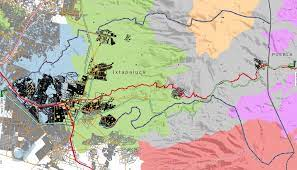

# Reto1. Módulos de registro 
Se tiene que realizar un registro de personas con capacidades diferente, para lo cual es necesario colocar 3 módulos de registro en las colonias de Ixtapaluca. Utilizando las coordenadas de las colonias propón la ubicación en coordenadas de cada uno de los módulos.  De manera que los módulos estén a una distancia equitativa de cada una de las colonias. 

Para esto tienes que genera una lista de tres coordenadas.   La carpeta de datos podrás encontrar un archivo con las coordenadas de cada una de las colonias.  El archivo *“Notebook guía reto1“* es notebook de Jupyter que ayudará a iniciar el reto.

## ¡Suerte!
